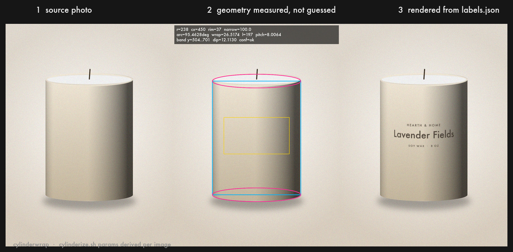

# cylinderwrap

Batch-renders label copy from a JSON file onto photographs of cylindrical
products — bottles, jars, tins, candles — using Fred Weinhaus' `cylinderize.sh`
for the distortion.

The point of it: **the cylinderize parameters are measured off each photo, not
hand-tuned per file.** Point it at a folder of product shots and a JSON file of
label text; it returns finished renders, a `params.json` of every derived value,
and a runnable `commands.sh` you can edit and re-run without this script.

It grew out of a label-mockup experiment for a stainless steel bottle line: the
tedious part was never the distortion, it was producing a plausible parameter
set for every single product shot. That is the part this automates. The worked
example here is a 17-image candle set, because a matte cylinder on a light
background is the least forgiving case — the silhouette barely separates from
the backdrop, so the geometry has to be recovered rather than eyeballed.



---

## Quick start

```bash
# 1. cylinderize.sh is NOT bundled (see Licensing). Fetch it once:
mkdir -p vendor
curl -s "http://www.fmwconcepts.com/imagemagick/downloadcounter.php?scriptname=cylinderize&dirname=cylinderize" \
  -o vendor/cylinderize.sh && chmod +x vendor/cylinderize.sh

# 2. render
./cylinderwrap.sh --config example/project.json
```

```
candle-01      ok    r=238  l=196  w=26.5174 p=8.0064  n=100.0  -> candle-01.jpg
candle-02      ok    r=263  l=164  w=26.5174 p=10.4945 n=100.0  -> candle-02.jpg
...
17 ok  0 skipped  0 failed   48s
```

Other modes:

```bash
./cylinderwrap.sh --config example/project.json --calibrate     # geometry overlays
./cylinderwrap.sh --config example/project.json --params-only   # numbers, no pixels
./cylinderwrap.sh --config example/project.json --only candle-03
./cylinderwrap.sh --config example/project.json -v              # show the solver working
```

Requires bash 3.2+ (stock macOS bash is fine), ImageMagick 6.9+ or 7.x, `jq`, `awk`.

---

## How the parameters are derived

Everything below is computed per image. Nothing is a per-file constant.

### 1. The candle is measured

A morphological edge map (not a colour flood-fill — cream wax on a cream
background defeats flood-fill) is reduced to a per-row `[leftmost, rightmost]`
extent profile. From that:

| value | how |
|---|---|
| `cx`, `r` | median left/right edge over the longest run of stable-width rows. That run rejects the wick above and the drop shadow below. |
| `barrel_top`, `barrel_bottom` | the ends of the same run, corrected for the fact that a 0.99·wmax threshold overshoots the true rim centre by `re·sqrt(1-0.99²)`. |
| `rim_minor` (`re`) | least-squares fit of the elliptical caps. |
| `narrow` | least-squares fit of width against y over the middle 60% of the barrel; 100 when the taper is under 0.6%. |

The rim fit is the interesting one. A point on a cap obeys
`|x-cx| = r·sqrt(1-((y-yc)/re)²)`, so substituting `t = sqrt(1-((x-cx)/r)²)`
makes it **linear**: `y = yc ± re·t`. Each of the four cap edges (top-left,
top-right, base-left, base-right) is regressed independently, gated on fit
residual and on spanning a wide enough range of `t`, and the survivors are
pooled by sample count.

Fitting *edges* rather than row width matters in practice: on a lit product one
side of a cap routinely fades into the background, which destroys the width
signal while leaving the opposite arc perfectly measurable.

### 2. The label geometry follows from the measurement

```
arc            = 2·asin(band.width)          # band.width is a fraction of candle width
-w wrap        = arc / 3.6                   # wrap is % of circumference; 360° = 100
-r radius      = r                           # verified: rendered band width = 2r·sin(arc/2)
-l length      = band height in px
-n narrow      = measured taper
label width    = 2r·sin(arc/2)               # exact to ±0.2% across a 10–100 wrap sweep
arc dip        = re·(1 - cos(arc/2))         # how far the band's top edge bows
```

The flat label canvas is sized `Hc = l·Wc / (r·arc_radians)` so that glyphs come
out **unstretched at the centre of the cylinder**, where they are actually read.
Get this wrong and the type is subtly squashed on every image.

### 3. Pitch is solved, not guessed

`-p` is not the camera elevation angle, and how it maps to on-screen curvature
also depends on `-e`, `-r` and `-l`. So the script does not assume a mapping — it
measures one:

1. render an opaque probe at the current `-p`
2. bbox height minus `-l` **is** the arc bulge
3. secant-iterate until that bulge equals `re·(1-cos(arc/2))` — the bulge the
   candle's own rim implies — to within a pixel

Converges in 2–3 renders (~0.4s each):

```
pitch solve: p=7.2707 -> bulge=11.0000 (target 12.1130)
pitch solve: p=8.0064 -> bulge=12.0000 (target 12.1130)
```

Everything is measured against that opaque probe rather than the label itself: a
label is mostly transparent, so its bounding box tracks the glyphs, not the band.
Output canvas size depends only on the parameters, so the probe's bbox transfers
to the real render exactly — and the script asserts the two canvases match before
using it.

### 4. Compositing

The distorted label is placed by measured bbox, then:

- **shading** — the candle's own greyscale, normalised about the mean luminance of
  the band (`-function Polynomial "s/mean,1-s"`), multiplied into the label's RGB.
  Normalising is what stops the whole label being globally darkened; it modulates
  instead.
- **edge falloff** — alpha × `1 - fade·((x-cx)/r)⁴`, so ink dims as it turns away.
- **silhouette clip** — an analytic mask built from the measured geometry, as a
  guard against spill.
- opacity, and a sub-pixel blur so the type sits in the photo's grain.

---

## Configuration

### `project.json`

```json
{
  "input_dir": "../demo/photos",
  "output_dir": "../out",
  "text_source": "labels.json",
  "output_format": "jpg",

  "defaults": {
    "font":  "/System/Library/Fonts/Supplemental/Futura.ttc",
    "color": "#4a4036",
    "band":       { "top": 0.26, "bottom": 0.58, "width": 0.74 },
    "text_inset": 0.05,
    "line_gap":   0.30,
    "align":      "center",
    "efactor":  1,
    "quality":  1.0,
    "shading":   0.55,
    "edge_fade": 0.40,
    "opacity":   0.94,
    "softness":  0.3,
    "blend":     "over"
  },

  "images": {
    "candle-04": { "band": { "top": 0.22, "bottom": 0.62, "width": 0.70 } }
  }
}
```

| key | meaning |
|---|---|
| `band.top` / `band.bottom` | where the label sits, as a fraction of barrel height, measured from the front-centre top of the candle body |
| `band.width` | label width as a fraction of candle width. Drives the arc: 0.74 → 95.5° |
| `arc_degrees` | set it directly instead, if you prefer |
| `efactor` | cylinderize `-e`. 1 is neutral; 2 exaggerates curvature |
| `quality` | flat-canvas scale. 1.0 keeps the centre of the label at ~1:1 |
| `shading` | 0 = flat sticker, 1 = fully takes the candle's luminance |
| `edge_fade` | how much ink dims toward the silhouette |
| `blend` | `over`, `multiply`, `hardlight` |
| `geometry` | per-image escape hatch: `cx`, `r`, `barrel_top`, `barrel_bot`, `rim_minor`, `narrow`. Anything set here overrides detection |
| `pitch`, `narrow` | pin them to skip the solver |
| `edge_threshold` | edge-map sensitivity, default 12(%) |

Anything in `defaults` can be overridden per image under `images`, and per record
under a `style` key in the label JSON. Later wins.

### `labels.json`

The canonical shape:

```json
[
  { "image": "candle-01.jpg", "lines": [
      { "text": "HEARTH & HOME",    "scale": 0.34, "kerning": 22 },
      { "text": "Lavender Fields",  "scale": 1.0 },
      { "text": "SOY WAX  ·  8 OZ", "scale": 0.28, "kerning": 16 } ] }
]
```

`scale` is relative point size; the block is fitted to the band as a unit, so
relative sizes hold across every image regardless of candle proportions.
`kerning`, `font` and `color` can be set per line.

**Your real JSON almost certainly looks different.** Rather than reshape your
file, remap it:

```bash
./cylinderwrap.sh --config project.json \
  --jq '[.products[] | {image: .sku + ".jpg",
                        lines: [{text: .brand, scale: 0.34},
                                {text: .scent},
                                {text: .size,  scale: 0.28}]}]'
```

The same expression can live in the config under `"jq"`. Bare arrays and the
common `{"items": …}` / `{"products": …}` / `{"labels": …}` wrappers work with no
remap at all.

---

## Output

```
out/
  candle-01.jpg …          finished renders
  flat/candle-01.png …     the flat label artwork (pre-distortion)
  calibration/…            geometry overlays, with --calibrate
  params.json              every derived value, per image
  commands.sh              runnable cylinderize.sh invocations
  contact-sheet.jpg        all renders, one sheet, for review
```

`commands.sh` is standalone — it reproduces the placement without cylinderwrap.sh:

```bash
"$CYL" -m vertical -r 238 -l 196 -w 26.5174 -p 8.0064 -e 1 -n 100.0 \
      -v background -b none -f none \
      "out/flat/candle-01.png" "out/dist_candle-01.png"
magick "demo/photos/candle-01.jpg" "out/dist_candle-01.png" \
      -gravity NorthWest -geometry +212+472 \
      -compose over -composite "out/candle-01_plain.jpg"
```

(Verified: running it produces the same geometry as the full pipeline. It omits
only the shading/falloff pass, which is the point — the raw parameters are legible
and hand-editable.)

---

## Tuning workflow

1. `--calibrate` and look at the overlays. Cyan = barrel, magenta = rim ellipses,
   yellow = label band, with the numbers in the corner.
2. If a candle is misread, pin it:
   ```json
   "images": { "candle-09": { "geometry": { "rim_minor": 52 } } }
   ```
3. Adjust `band.top` / `band.bottom` / `band.width` to taste — those are design
   decisions, not measurements.
4. Re-run. `--only <id>` for one image.

---

## Things that will bite you (and are handled)

Each of these was reproduced on ImageMagick 7.1.2 before being fixed:

- **A missing font is a WARNING, not an error.** ImageMagick exits 0 and silently
  substitutes a default face — a whole batch can come out in the wrong typeface
  with no failure anywhere. The script probes and dies loudly.
- **Homebrew's ImageMagick has no fontconfig.** `magick -list font` returns
  nothing, so `-font Futura` does not resolve. Use absolute font paths.
- **Inline text is not literal.** `label:"@Company Name"` reads a *file* called
  `Company Name`, and `%[fx:40+2]` inside label text is *evaluated* and renders
  "42". Real label copy contains `@`, `%`, apostrophes and quotes. All text
  reaches ImageMagick via `label:@file`, which is literal.
- **`jq -r` adds a trailing newline**, which silently doubles a rendered line's
  height. `jq -j`.
- **`read` returns non-zero on EOF-without-newline** even though it assigns — with
  `set -e` that kills the script. All `-format` strings end in `\n`.
- **awk parses `>` inside `printf` as a redirection**, so
  `printf "%f", a > b ? x : y` is a syntax error, not a ternary. Parenthesise.
- **`-flatten` drops alpha.** `-layers merge -background none` keeps it.
- **cylinderize.sh calls the legacy `convert` binary**, which IM7-only installs may
  not ship. The script drops a `convert → magick` shim on PATH rather than
  editing Fred's script.
- **`-geometry "+-5+10"` is invalid.** Offsets are formatted `%+d%+d`.
- **`-gravity` persists across a pipeline.** Pinned to `NorthWest` explicitly.

---

## Assumptions

- One product, roughly centred, on a plain-ish background, shot near
  straight-on. Cluttered or multi-product frames need the `geometry` override.
- The camera is above the rim (`-d down`, the default). A shot from below needs
  `-d up` — not currently exposed; one line to add.
- Detection was validated against 17 synthetic candles with known ground truth:
  radius within 1.3%, base rim centre within 1–3px, rim minor axis within 4.9%
  mean absolute error. Synthetic fixtures are not real photographs — the
  `--calibrate` overlay is how you check real ones.

---

## Licensing — read this before commercial use

`cylinderize.sh` is © Fred Weinhaus and is **free for non-commercial use only**.
Commercial or for-profit use requires a licence arranged directly with him
(`fmw at alink dot net`), and redistribution requires his permission.

Accordingly this repo **does not bundle it** — `vendor/cylinderize.sh` is
gitignored and the quick start fetches it from his site. If this pipeline is
going into a commercial product workflow, sorting out that licence is a real
line item, not a formality.

`cylinderwrap.sh` and the demo generator are mine and carry no such restriction —
they are MIT licensed (see `LICENSE`). That licence covers this repo only, not
`cylinderize.sh`.
